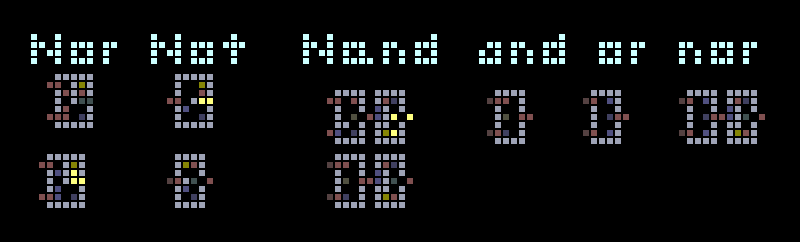

# Logic Puzzle

## Description
You are trying to find the right eight-bit binary number. Once you do, convert it to decimal and enclose it in `quack{...}`. You should get a number from 0 to 255 (inclusive). The flag should pulse when you get the correct input. You have eight attempts. 

*Example flag:* `quack{100}`

All it takes to solve this challenge is a **spark**. Oh and maybe the powder toy.

*Author: Javad*

## Hint
Logic gates can be implemented in a variety of ways in Powder Toy. Here's some, although I can't guarantee that they'll perfectly match the implementation is this challenge.

