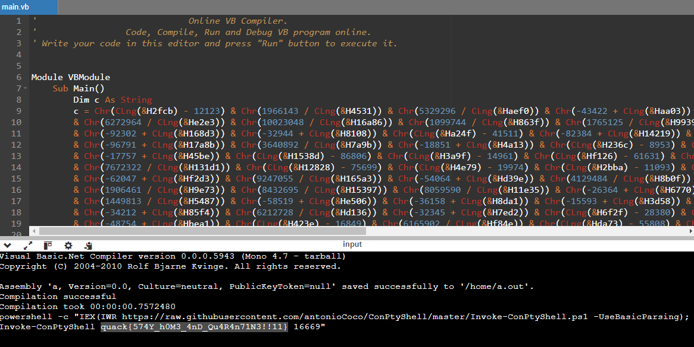

# Quarantine
**Category**: Forensics
**Author**: samiko
**Difficulty**: Hard (500pts)

### Description
I received this document from my friend which promised cute cat pictures. But as it turns out, my friend had been hacked yesterday and the document was actually a virus! Good thing my antivirus caught it before I opened it.

I have attached a disk image of my computer, can you use your forensics skills to find out who hacked my friend?

### Solution
Use [AccessData FTK Imager](https://www.exterro.com/ftk-product-downloads/ftk-imager-version-4-7-1) to import the AD1 disk image (File -> Add Evidence Item -> Image File), then export all files (File -> Export Files). If using Linux, the AD1 file can be opened with [Autopsy](https://www.autopsy.com/download/) using the [AD1 Extractor](https://github.com/markmckinnon/Autopsy-Plugins/tree/master/AD1_Extractor) plugin.

After exporting the files, by checking the `MPDetection` log in `\ProgramData\Microsoft\Windows Defender\Support`, we find out a document by the name `snowy.docm` was quarantined by Windows Defender.

```
2024-08-21T00:20:12.891 DETECTION HackTool:Win32/Mimikatz!pz containerfile:C:\Users\Marino\Desktop\snowy.docm 
2024-08-21T00:20:12.891 DETECTION HackTool:Win32/Mimikatz!pz file:C:\Users\Marino\Desktop\snowy.docm->word/embeddings/oleObject1.bin->(Ole Stream 0)->mimikatz.exe 
```

When a file is quarantined by Windows Defender, a few things happen:
- Metadata of when, why, and how the file was quarantined is stored in a `QuarantineEntry` file, which is RC4-encrypted and saved to the `\ProgramData\Microsoft\Windows Defender\Quarantine\Entries` folder.
- Contents of the file is stored in a `QuarantineEntryResourceData` file, which is also RC4-encrypted and saved to the `\ProgramData\Microsoft\Windows Defender\Quarantine\ResourceData` folder.[^1]

[^1]: https://blog.fox-it.com/2023/12/14/reverse-reveal-recover-windows-defender-quarantine-forensics/

Using open source tools such as [maldump](https://github.com/NUKIB/maldump) and [defender-dump](https://github.com/knez/defender-dump), we can extract the contents of the quarantined file.

`$ maldump -l ./exported-files`
```
--- Microsoft Defender ---
C:\Users\Marino\Desktop\snowy.docm
C:\Users\Marino\Desktop\eicar.txt
```
`$ maldump -a ./exported-files`
```
Exported 2 object(s) into 'quarantine.tar'
Written 2 row(s) into file 'quarantine.csv'
```
`$ tar xvf quarantine.tar`
```
Microsoft Defender/dc0f92e5cd84fa02465f13a3b8f453d0
Microsoft Defender/44d88612fea8a8f36de82e1278abb02f
```

We can check the file types of the extracted files:

`$ file ./Microsoft\ Defender/*`
```
./Microsoft Defender/44d88612fea8a8f36de82e1278abb02f: EICAR virus test files
./Microsoft Defender/dc0f92e5cd84fa02465f13a3b8f453d0: Microsoft Word 2007+
```

The file beginning with `44d8` is an EICAR antivirus test file and can be ignored. We're only interested in the file beginning with `dc0f`, which is a Word document. Since Word documents are functionally ZIP files, we can unzip it:

`$ unzip dc0f92e5cd84fa02465f13a3b8f453d0 -d snowy`

The Word document contains a VBA macro stored in the binary file `vbaProject.bin`, which we can decompile with [pcode2code](https://github.com/Big5-sec/pcode2code/) or `oledump`:

`$ pcode2code ./snowy/word/vbaProject.bin -o macro.vba`

`$ cat macro.vba`

```vb
Sub Document_New()
  
End Sub

Sub Document_Open()
  
    c = Chr(CLng("&H2fcb") - 12123) & Chr(1966143 / CLng("&H4531")) & ...
        ...
    gg = Shell(c, 1)

End Sub
```

The decompiled VBA code is obfuscated, but we can spot that the variable `c` is passed to the `Shell()` function as its `PathName` argument. We can defeat the obfuscation and identify what command would be executed by replacing the `Shell()` function with one that will print the `c` variable, such as `MsgBox()` (if running as VBA in a macro) or `Console.WriteLine()` (if running as VB.NET), then running the modified code.

If the Microsoft Office suite is not available, an online compiler (e.g. https://www.onlinegdb.com/online_vb_compiler) can be used to run the VBA code. However, `c` needs to be declared first, and quotes surrounding each `long` value need to be removed for the code to be compatible with VB.NET. For example:

```vb
Module VBModule
    Sub Main()
        Dim c As String
        c = Chr(CLng(&H2fcb) - 12123) & Chr(1966143 / CLng(&H4531)) & ... 
            ...
        Console.WriteLine(c)
    End Sub
End Module
```



The flag can be found in the host parameter for the `Invoke-ConPtyShell` reverse shell script.

**Flag:** `quack{574Y_h0M3_4nD_Qu4R4n71N3!!11}`